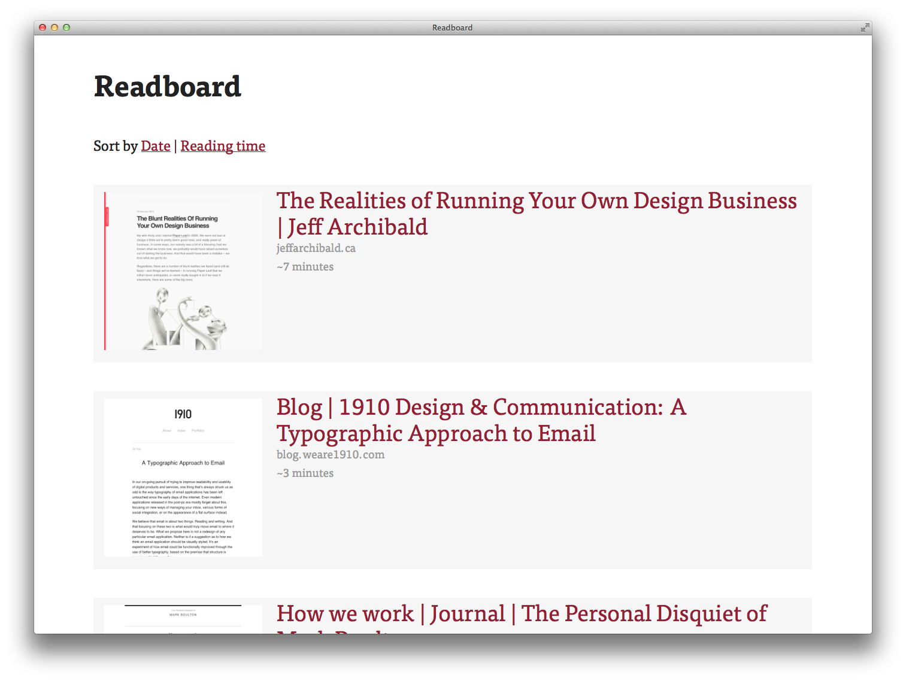

# Readboard

> Read your Pinboard pins. Beautifully.

Readboard is a reading client for Pinboard "to read" bookmarks, comparable to Pocket or Readability.




## Setup

1. `npm install && bower install`
2. Create a file `token.js` with the following content:  
```js
module.exports = "username:token"
```  
Replace the `username:token` part with your API token from your [Pinboard Settings](https://pinboard.in/settings/password).

## Status Quo

Right now, you have to manually run the readboard script to fetch and process your reading list. Readings are saved in JSON files. In the future, they will be managed in a database and update are run by a server process regularly.

For now:

* `node readboard.js --fetch` fetches all your pins
* `node readboard.js --process` processes your "to read" pins and enriches them with screenshots. This can take a while. Like, a whoooole while.
